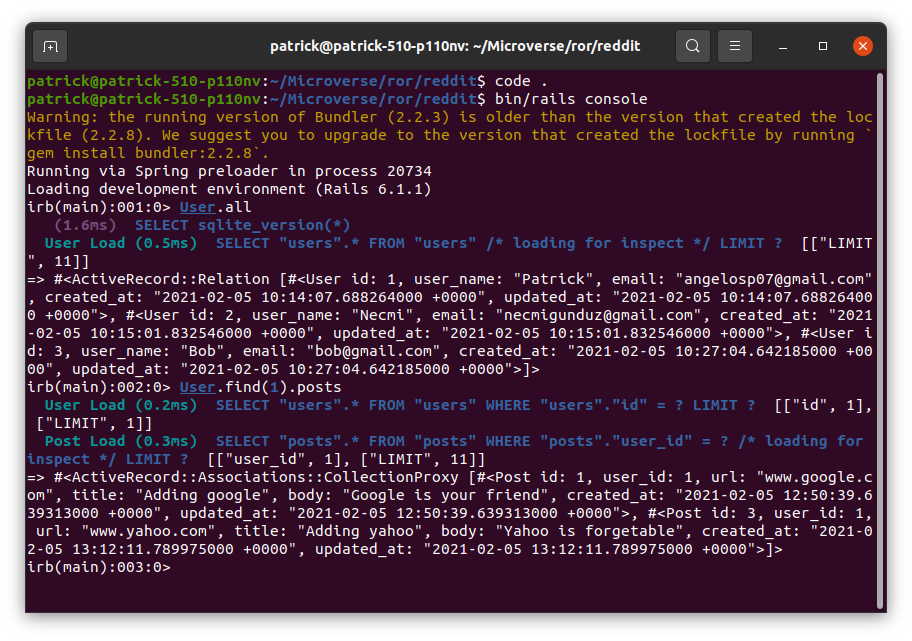

# Micro-Reddit

This project is about making a database for a page that resembles Reddit.
The database consists of the following three tables and models:
- Users
- Posts
- Comments

## Built With

- Ruby on Rails
- Ruby 2.7.2

## Getting Started

To get started with the project follow the steps below:
- `git clone git@github.com:necmigunduz/reddit.git`
- `cd reddit`
- `git checkout reddit`
- `bundle install`
- `bin/rails db:migrate`
- `bin/rails console`
- Create instances of User, Post and Comment
- If you need further assistance for creating instances visit the [Active Record guides](https://guides.rubyonrails.org/active_record_basics.html) of Rails

## Author

👤 **Patrikis Angelos**

- GitHub: [@patrick-angelos](https://github.com/patrick-angelos)
- Twitter: [@AngelosPatrikis](https://twitter.com/AngelosPatrikis)
- LinkedIn: [Angelos Patrikis](https://www.linkedin.com/in/patrikis-angelos/)

👤 **Necmi Gunduz**
- GitHub: [@necmigunduz](https://github.com/necmigunduz)
- Twitter: [@necm_gun](https://twitter.com/necm_gun)
- LinkedIn: [LinkedIn](https://www.linkedin.com/in/necmigunduz/)

## 🤝 Contributing

Contributions, issues, and feature requests are welcome!

## Show your support

Give a ⭐️ if you like this project!

## 📝 License

Copyright 2021 Necmi Gunduz & Patrikis Angelos

Permission is hereby granted, free of charge, to any person obtaining a copy of this software and associated documentation files (the "Software"), to deal in the Software without restriction, including without limitation the rights to use, copy, modify, merge, publish, distribute, sublicense, and/or sell copies of the Software, and to permit persons to whom the Software is furnished to do so, subject to the following conditions:The above copyright notice and this permission notice shall be included in all copies or substantial portions of the Software.

THE SOFTWARE IS PROVIDED "AS IS", WITHOUT WARRANTY OF ANY KIND, EXPRESS OR IMPLIED, INCLUDING BUT NOT LIMITED TO THE WARRANTIES OF MERCHANTABILITY, FITNESS FOR A PARTICULAR PURPOSE AND NONINFRINGEMENT. IN NO EVENT SHALL THE AUTHORS OR COPYRIGHT HOLDERS BE LIABLE FOR ANY CLAIM, DAMAGES OR OTHER LIABILITY, WHETHER IN AN ACTION OF CONTRACT, TORT OR OTHERWISE, ARISING FROM, OUT OF OR IN CONNECTION WITH THE SOFTWARE OR THE USE OR OTHER DEALINGS IN THE SOFTWARE.